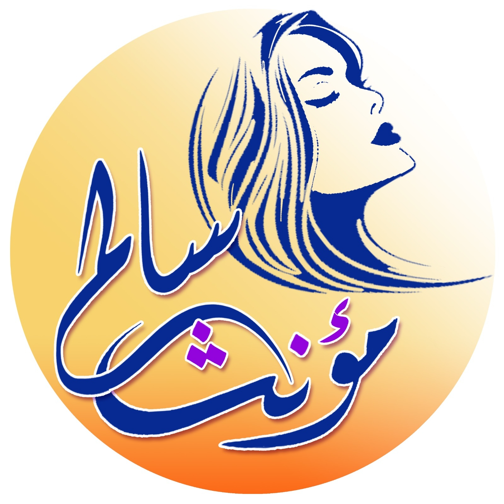

# مؤسسة مؤنث سالم للتنمية — Brand Guide v1.0

---

## المعلومات الأساسية

| | |
|---|---|
| **الاسم الرسمي** | مؤسسة مؤنث سالم للتنمية |
| **الاسم الإنجليزي** | Mo3nth Salem for Development Foundation |
| **المؤسسة** | أسماء فتحي |
| **المقر** | شارع الجامعة، الحيسين، الجيزة |
| **التسجيل** | وزارة التضامن الاجتماعي — قانون 149/2019 |
| **المجال** | حقوق الإنسان / حقوق النساء |
| **Domain** | muanathsalem (Instagram/Facebook/LinkedIn) |

---

## الرؤية والرسالة

### الرؤية
> مجتمع مصري حر يقوم على مبادئ العدالة، والكرامة الإنسانية، واحترام حق المواطنة، وحقوق الإنسان، بحيث تتمكن النساء من التمتع بالمساواة الكاملة.
> **عالم عمل آمن وعادل للنساء في كافة المجالات**

### الرسالة
مؤسسة مدنية نسوية حقوقية تسعى لتحقيق المساواة من منظور النوع الاجتماعي، ومناهضة العنف المبني على النوع الاجتماعي، وتعمل على ضمان حق الوصول العادل للموارد، والمساهمة في عملية التنمية من خلال توفير الدعم النفسي والقانوني وتشجيع مشاركة النساء السياسية والاقتصادية والاجتماعية.

---

## الهوية البصرية

### اللوجو
- **الشكل:** دائرة مع سيلويت امرأة بشعر منسدل — وجه بروفايل ينظر للأعلى
- **الخلفية:** تدرج ذهبي → برتقالي `#F5A623`
- **الكتابة:** "مؤنث سالم" بخط كاليغرافي عربي حر
- **لون الكتابة:** كحلي غامق `#1E3A8A`
- **نقطة بنفسجية:** في وسط الكلمة — تمثيل للـ accent color
- **الاستخدام:** avatar، favicon، header، watermark على المحتوى


### الألوان

| الاسم | HEX | الاستخدام |
|-------|-----|-----------|
| **كحلي Primary** | `#1E3A8A` | Headings، CTA، Nav، Borders |
| **ذهبي Secondary** | `#F5A623` | Accents، Icons، Section highlights |
| **بني-أحمر** | `#8B1A1A` | Headers في الوثائق الرسمية |
| **بنفسجي Accent** | `#7C3AED` | Tags، Badges، Links، نقطة اللوجو |
| **كريمي Background** | `#FFF8ED` | Page background |
| **بيج Surface** | `#F9F6F0` | Cards، Panels |
| **رمادي فاتح** | `#F5F5F5` | Secondary backgrounds |

### الخطوط

```
Cairo Bold 700    → H1/H2، عناوين الحملات، headlines قوية
Cairo SemiBold 600 → H3، card titles، campaign names
Cairo Medium 500  → subheadings، labels
Tajawal Regular 400 → body text، paragraphs، descriptions
Tajawal Medium 500  → highlighted body text، quotes
```

---

## القيم المؤسسية (للاستخدام في المحتوى)

1. **التعاون والشراكة** — العمل الحقوقي قائم على التنسيق مع كافة الأطراف
2. **الحوكمة** — شفافية كاملة في الأنشطة والميزانيات
3. **الالتزام** — الوفاء بما تعهدت به المؤسسة تجاه الفئات المستهدفة
4. **العدالة** — لكل مستفيدة الحق في الخدمات دون أي اعتبار
5. **الابتكار والإبداع** — تشجيع الأفكار المميزة ومكافأة التجديد
6. **المهنية والتطوير** — عمل قائم على منهجية مهنية واضحة

---

## الصوت والنبرة — Brand Voice

### المبادئ
- **جريئة ومباشرة:** لا تبريرات، لا تلطيف للحقيقة
- **حاضنة وآمنة:** المستفيدة تحس بالأمان والدعم
- **موثوقة:** أرقام وبيانات وشهادات حقيقية
- **لا استعراض:** الأفعال أهم من الكلام

### اللغة
- **الموقع:** فصحى مبسطة — واضحة وسهلة الفهم
- **السوشيال:** عامية مصرية + فصحى مبسطة حسب السياق
- **الوثائق الرسمية:** فصحى رسمية كاملة

### أمثلة على الـ Brand Voice
✅ "العنف بيبقى أثر طويل وتكلفته بتدفعها الستات سنين"
✅ "فاتورة العنف — والستات هي اللي بتدفعها"
✅ "مش ذنبي إني أم"
✅ "بدون أجر — مشكلة بتواجهها الصحفيات كل يوم"

❌ "نسعى جاهدين لتحقيق المساواة..."
❌ "يؤسفنا أن..."
❌ كلام فضفاض بدون أرقام أو شهادات

---

## الأهداف الاستراتيجية 2025-2030

1. مشاركة فاعلة للنساء في الحياة الاقتصادية وحماية حقوق النساء العاملات
2. مشاركة نساء مصر في عملية صنع القرار في الفضاءين العام والخاص على أساس العدالة والمساواة
3. ضمان حماية النساء والفتيات من كافة أشكال العنف المبني على النوع الاجتماعي
4. تتمتع المؤسسة بقدرات فعالة وبنية مؤسسية متماسكة للقيام بدورها الطليعي في المجتمع

---

## الحملات المؤرشفة (16+ حملة)

| # | اسم الحملة | الموضوع | الرابط |
|---|-----------|---------|--------|
| 1 | أيوه أنا أتعنفت | الوعي بأشكال العنف | facebook.com/share/p/1BEuBCkFkG |
| 2 | بدون أجر | العمل غير المأجور | facebook.com/share/p/1CqFsvNikH |
| 3 | الدعم النفسي للفلسطينيات | دعم نفسي | facebook.com/share/p/13nBsbvNeo |
| 4 | أخترتيها ليه | الاختيار المهني | facebook.com/share/p/19XkKH6vtK |
| 5 | الأجر العادل حق | حقوق اقتصادية | facebook.com/share/p/15F4wkf7zs |
| 6 | ورشة دعم نفسي للصحفيات | دعم نفسي | facebook.com/share/p/18HMovwhRH |
| 7 | مش ذنبي إني أم | التمييز بسبب الأمومة | facebook.com/share/p/1DivtQi2mW |
| 8 | مطالب الصحفيات ضرورة | حقوق نقابية | facebook.com/share/p/159MnwmpHk |
| 9 | ورشة الدعم النفسي والعنف الرقمي | أمان رقمي | facebook.com/share/p/14Dqto7evs |
| 10 | اتفاقية العمل 190 | تشريعات دولية | facebook.com/share/p/1B6tdH35Qy |
| 11 | من أول المشوار | تمكين مهني | facebook.com/share/p/15Zfav4ky5 |
| 12 | السلامة الرقمية | أمان رقمي | facebook.com/share/p/18C4uyzd6N |
| 13 | اللغة الحساسة للنوع الاجتماعي | توعية | facebook.com/share/p/15JwVwiqwN |
| 14 | التغيرات المناخية والقصص الصحفية | صحافة | facebook.com/share/p/15e3d26hB5 |
| 15 | صناعة البيانات الاجتماعية | بحث | facebook.com/share/p/1B3x4JwLQ9 |
| 16 | طعم الكلام: ورشة كتابة إبداعية | تدريب | facebook.com/share/p/15MNfoV98T |

### الحملات المستمرة
- **فاتورة العنف** — التكلفة الاقتصادية والنفسية للعنف (2025، نشطة)
- **أمان رقمي / أمان قلمي** — حماية الصحفيات من العنف الإلكتروني
- **مؤنث سالم جونيور** — برنامج للأطفال 8-14 سنة — سفراء الأمان الرقمي

### التدريبات
- تدريب صحافة الموبايل — من الفكرة للنشر (أيام 1-2-3 نوفمبر 2025)
- TOT سفراء الأمان الرقمي (أكتوبر 2025)

---

## الجمهور المستهدف

**الأساسي:**
- النساء والفتيات في مختلف الأعمار
- الصحفيات والعاملات في الإعلام
- النساء العاملات في بيئات عمل غير آمنة

**الثانوي:**
- الجمعيات والمؤسسات العاملة في حقوق المرأة
- الناشطات النسويات
- الناشطات والقائدات النقابيات
- الإعلاميون والباحثون

---

## المحتوى الرقمي

### السوشيال ميديا
- Facebook: muanathsalem (الأكثر نشاطاً)
- Instagram: muanathsalem
- LinkedIn: مؤنث سالم (357 followers)

### أسلوب البوستات
- الـ headline بالعربي كبير وواضح — Cairo Bold
- شهادات حقيقية بالاقتباس المباشر
- تصميم flat — ألوان كحلي + ذهبي
- الإحصاءات والأرقام بارزة
- هاشتاقات: #مؤنث_سالم #فاتورة_العنف وغيرها